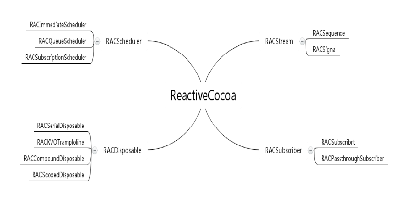
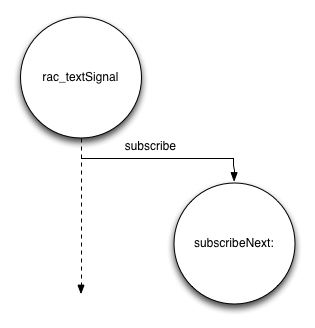

- [Learn You a Haskell for Great Good!](http://learnyouahaskell.com/chapters)

- [ReactiveCocoa 模式 —— Signals](http://noark9.github.io/2015/01/25/rac-signal-from-rcdio/)

- [ReactiveCocoa Design Patterns](http://rcdp.io)

- [ReactiveCocoa v2.5 源码解析之架构总览](http://blog.leichunfeng.com/blog/2015/12/25/reactivecocoa-v2-dot-5-yuan-ma-jie-xi-zhi-jia-gou-zong-lan/)

- [最快让你上手ReactiveCocoa之基础篇](http://www.jianshu.com/p/87ef6720a096)

- [iOS Reactivecocoa（RAC）知其所以然](http://gold.xitu.io/post/57caf01b5bbb500074ebddf6)

- [ReactiveCocoa 模式 —— Signals](http://noark9.github.io/2015/01/25/rac-signal-from-rcdio/)

- [基于ReactiveCocoa和MVVM设计的购物车基本操作实现代码解析](http://qiaotongxin.cc/2016/08/06/20160806/)

- [使用ReactiveCocoa实现iOS平台响应式编程](http://www.itiger.me/?p=38)

- [RAC 2.x 文档](https://github.com/ReactiveCocoa/ReactiveCocoa/tree/2.x-maintenance/Documentation)

- [http://benbeng.leanote.com/post/ReactiveCocoaTutorial-part2](http://benbeng.leanote.com/post/ReactiveCocoaTutorial-part2)
throttle

- [ReactiveCocoa 基本操作](http://www.yiqivr.com/2015/10/06/ReactiveCocoa-%E5%9F%BA%E6%9C%AC%E6%93%8D%E4%BD%9C/)

- [Reactive Cocoa Tutorial  神奇的Macros](http://blog.sunnyxx.com/2014/03/06/rac_1_macros/)

- [How I Learned to Write Custom Signals in Reactive Cocoa](https://yalantis.com/blog/how-i-learned-to-write-custom-signals-in-reactive-cocoa/)

- [最快让你上手ReactiveCocoa之进阶篇](http://www.jianshu.com/p/e10e5ca413b7) 
> 豆瓣API 

RAC overview

RAC 由四大核心组件构成


1. RACStream 以Monad概念进行设计，代表任意的流值。RACSignal是ReactiveCocoa的核心，继承自RACStream。
2. 订阅者RACSubscriber的实现类及其子类，订阅信号源。
3. 调度器RACScheduler及其子类，调度订阅者所订阅的信号源。
4. 清洁工RACDisposable及其子类，在特定情况下调用对象的dispose方法执行清理工作。

### Streams
Stream有两种类型，一种是push-driver的RACSignal，一种是pull-driven的RACSequence。  

- push-driven：表示这个stream在创建的时候是没有值的，只有在将来（接收到网络请求，或是用户输入事件）的时候才会有值。
- pull-driven：表示这个stream在创建的时候就已经有值了，并且我们可以从stream中顺序的获取里面的值，在ReactiveCocoa中通常通过Cocoa的集合对象（比如NSArray，NSSet，NSDictionary或者NSIndexSet）创建。


### Signals

信号是推驱动的流（push-driven stream）
信号通常表示将来时间传输的数据，值通过信号传输，表示工作完成或者数据已经接收，用户如果要访问值则需要提前进行订阅，这样值被传输时会被push到订阅者。


Signals generally represent data that will be delivered in the future. As work is performed or data is received, values are sent on the signal, which pushes them out to any subscribers. Users must subscribe to a signal in order to access its values.


FRP的核心是信号，信号在ReactiveCocoa(以下简称RAC)中是通过RACSignal来表示的，信号是数据流，
信号可以被叠加（chaining）、分割（splitting）或合并（combining）
[Functional Reactive Programming on iOS with ReactiveCocoa](http://www.teehanlax.com/blog/reactivecocoa/)  
stream有溪流的意思。类比到生活中的水，需要有水龙头，需要信号时，可以进行subscribe (即打开水龙头)。如果水中有杂质，需要进行过滤（filter），如果需要像糖水一样的水，可以进行装配进行修改（map）。如果水流过小，或者热、冷混合时，就相当于把多个水流合成一个水流（combineLatest:reduce:）

(来自 [ReactiveCocoa与Functional Reactive Programming](http://limboy.me/tech/2013/06/19/frp-reactivecocoa.html))


OC 命令式编程范式（imperative paradigm），开发者主要关注的是怎样做（how to solve a task ），声明式编程范式（declarative paradigm）关注的是做什么（what task is）


RAC 为 textField 添加一个 rac_textSignal 信号，信号在textField 内容发生变化时可以发送事件，

```ruby
- (RACSignal *)rac_textSignal {
	@weakify(self);
	return [[[[[RACSignal
		defer:^{
			@strongify(self);
			return [RACSignal return:self];
		}]
		concat:[self rac_signalForControlEvents:UIControlEventAllEditingEvents]]
		map:^(UITextField *x) {
			return x.text;
		}]
		takeUntil:self.rac_willDeallocSignal]
		setNameWithFormat:@"%@ -rac_textSignal", self.rac_description];
}
```

使用时  

```ruby
[self.textField.rac_textSignal subscribeNext:^(NSString *value) {
    NSLog(@"Text field has been updated: %@", value);
}];
```

> 注意此处是 rac_textSignal 自己发送事件，自己订阅




- 向指定调度器传输信号事件 [Deliver signal events onto a known scheduler](https://github.com/ReactiveCocoa/ReactiveCocoa/blob/2.x-maintenance/Documentation/DesignGuidelines.md#deliver-signal-events-onto-a-known-scheduler)


> 当从一个方法中获取信号（作为一method的返回值），或者和这样的信号结合（combine），无法得知将要传输信号所在的线程.尽管RAC保证事件会线性执行，但有时需要更强的保证，比如进行UI更新（UI更新必须在主线程中进行）
此时，需要使用  `-deliverOn:` 操作来强制一个信号事件在指定的调度器上进行。

比如后台线程下载图片  

```Objective-C
-(RACSignal *)signalForLoadingImage:(NSString *)imageUrl {
    RACScheduler *scheduler = [RACScheduler
        schedulerWithPriority:RACSchedulerPriorityBackground];

    return [[RACSignal createSignal:^RACDisposable *(id subscriber) {
        NSData *data = [NSData dataWithContentsOfURL:[NSURL URLWithString:imageUrl]];
        UIImage *image = [UIImage imageWithData:data];
        [subscriber sendNext:image];
        [subscriber sendCompleted];
        return nil;
    }] subscribeOn:scheduler];
}
```  

上面的方法首先获取一个后台scheduler，来让signal不在主线程执行。然后，创建一个signal来下载图片数据，当有订阅者时创建一个UIImage。最后是subscribeOn：来确保signal在指定的scheduler上执行。


调用处：  

```Objective-C
cell.twitterAvatarView.image = nil;
[[[self signalForLoadingImage:_profileImageUrl]
    deliverOn:[RACScheduler mainThreadScheduler]]
    subscribeNext:^(UIImage *image) {
        cell.ProfileImageView.image = image;
    }];
```


### Subscription
订阅者等待或者有能力等待来自信号发送的事件，一个类实现 `RACSubscriber` 协议后就成为一个订阅者。

订阅事件会持有信号，


### Subjects

主题（subject) ,相应的类是 RACSubject , 是一种可以被手动管理的信号.实现了  RACSubscriber  协议，所以也是一个订阅者，它可以生成信号源，也可以订阅信号（即同时是信号、订阅者）


### Commands
http://www.yiqivr.com/2015/10/19/译-ReactiveCocoa基础：理解并使用RACCommand/

### Connections

### Sequences

### Disposables

### Schedulers


